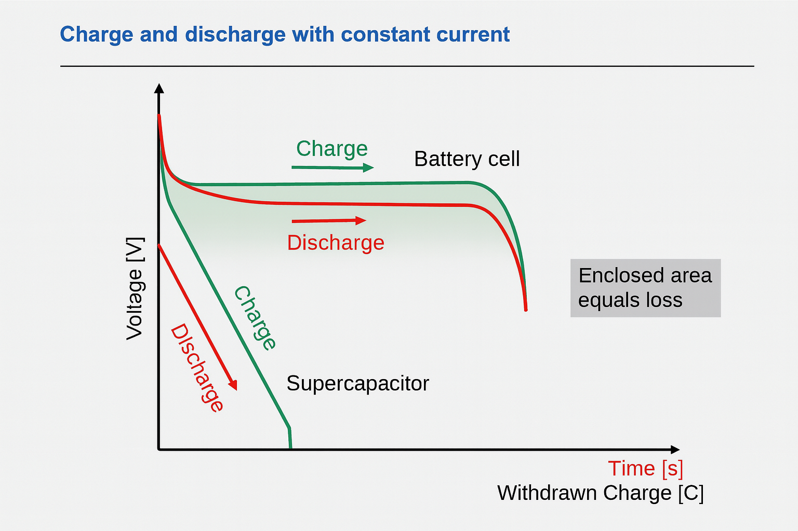

# 🔋 Battery Usage in Vehicles
## Chapter Overview

In this chapter, I explore the role of **electrical energy storage technologies** in modern vehicles and other devices such as wind turbine, with a focus on **batteries** and **capacitors**. These components are essential for powering electric drivetrains, supporting hybrid systems, and enabling energy recovery in automotive applications. 

--- 

# Electrical energy storage: capacitors and batteries
---
Here I explore which Energy sources are suitable for modern technologies basically we all knows we are using batteries, but these comparisons helps us to understand why we are using those over other energy storage sources.

## 1. Basic idea

- **Capacitors:** Store energy in an electric field between two conductors separated by an insulator (dielectric).
- **Batteries:** Store energy in chemical form via redox (reduction–oxidation) reactions in an electrochemical cell.

Both are energy storage devices, but they work on completely different physical principles.

---


## 2 Parallel‑plate capacitor 

Any two conductors separated by an insulating medium form a capacitor. A common ideal model is the **parallel‑plate capacitor**: two flat plates, area \(A\), distance \(d\), with a dielectric in between.

### 2.1 Capacitance formula

For a parallel‑plate capacitor in a homogeneous dielectric:

- C = (ε₀ * εᵣ * A) / d
- C: Capacitance in farads (F)
- ε₀: Vacuum permittivity ≈ 8.854 × 10⁻¹² F/m
- εᵣ: Relative permittivity of the dielectric
- A: Area of the plates (m²)
- d: Distance between plates (m)

Capacitance is also defined by the charge–voltage relation:

### 2.2 Charge–Voltage Relationship

```text
Q = C * U
```

- Q: Charge in coulombs (C)
- U: Voltage across the capacitor (V)

### 2.3 Energy stored in a capacitor

The energy stored in a charged capacitor is:

```
E = 0.5 * C * U^2
```
E: Energy in joules (J)

## 3. Electrolytic capacitors

Electrolytic capacitors are a special type of capacitor with:

- **Metal electrode** (e.g. aluminum, tantalum, niobium)
- **Thin oxide layer** on the metal acting as the dielectric
- **Electrolyte** (ion‑conducting medium) acting as the counter‑electrode

Key points:

- The oxide layer is extremely thin → very large capacitance per volume.
- They are **polarized**: they must be connected with the correct polarity (plus/minus), otherwise the oxide layer can be damaged.
- Charge separation at the dielectric–metal interface creates the electric field and stored energy.

---

## 4. Batteries

Batteries are electrochemical devices based on **redox reactions**:

- **Electrodes:** electrically conductive, chemically active materials (e.g. metals, metal oxides).
- **Electrolyte:** ion‑conducting medium (liquid, gel, or solid).
- **Redox reactions:** one electrode undergoes oxidation, the other reduction; electrons flow through the external circuit, ions move through the electrolyte.

Battery Basics

Batteries store energy via redox reactions. They typically provide a nearly constant voltage during discharge.

```
E ≈ U * Q
```

- E: Energy in joules (J)
- U: Nominal voltage (V)
- Q: Total charge transferred (C)


In an ideal model, a battery provides an approximately **constant terminal voltage** over a large part of its discharge, until the reactants are depleted or internal resistance becomes significant.

---

## 5. Capacitors vs. batteries

| Aspect                | Capacitor                                  | Battery                                      |
|-----------------------|---------------------------------------------|----------------------------------------------|
| Storage principle     | Electric field between conductors          | Chemical energy via redox reactions          |
| Main relation         | \(Q = C \cdot U\)                          | Approx. constant cell voltage, capacity in Ah|
| Energy scaling        | \(E \propto C U^2\)                        | \(E \approx U \cdot Q_{\text{chem}}\)        |
| Charge/discharge      | Very fast                                  | Slower, limited by chemistry                 |
| Voltage behavior      | Voltage changes with charge                | Nearly flat voltage over much of discharge   |
| Polarity              | Some types polarized (e.g. electrolytic)   | Cells have defined polarity                  |
| Typical use           | Filtering, buffering, pulsed power, timing | Long‑term energy supply                      |

---

## 6. Simple conceptual graphs

### 6.1 Capacitance vs. plate distance \(d\)

At fixed plate area (A) and dielectric material:
```
C ∝ 1 / d
```
This means:
- When the distance d decreases, capacitance increases.
- When the distance d increases, capacitance decreases.

``` Text
Capacitance (C)
|
|\
| \
|  \
|   \
|    \
|     \
|      \______________  Plate distance (d)
```

Interpretation: Smaller plate spacing → larger capacitance.


### 6.2 Capacitor voltage vs. stored charge

``` Text

Using Q=CU:

Q
|          /
|        /
|      /
|    /
|  /
|/_____________ U
```
Interpretation: For a given capacitor, charge increases linearly with voltage.

### 6.3 Battery voltage vs. state of charge (idealized)


``` Text
U
|---------
|        |
|        |
|        |______
|________________ SoC
   0%        100%

```
Interpretation: Ideal battery: nearly constant voltage over most of its state‑of‑charge range, then drops near empty.

# ⚡ 7 Supercapacitors (Electric Double-Layer Capacitors)

Supercapacitors are high-performance energy storage devices that store charge electrostatically — not chemically like batteries. They are ideal for applications requiring rapid charge/discharge and high power density.

---

## 🔬 How They Work

- Charge is stored at the interface between **carbon electrodes** and **electrolyte ions**.
- The separation distance between charges is extremely small — typically **less than 1 nanometer**.
- This creates a **double-layer** of charge, similar to a capacitor but with much higher surface area and energy density.

---

## 🧪 Aging and Degradation

Supercapacitors degrade over time due to:

- **Chemical changes** in electrode or electrolyte materials
- **High operating temperatures**
- **Voltage stress** (especially overvoltage or voltage spikes)
- **Mechanical stress** and **electrical cycling**

These factors increase **internal resistance (ESR)** and reduce usable capacity.

---

## ⚙️ Performance Characteristics

| Parameter              | Typical Value / Behavior                          |
|------------------------|---------------------------------------------------|
| Efficiency (η)         | ~95% (energy out vs. energy in)                   |
| Charge cycles          | >1,000,000 (no irreversible reactions)            |
| Power density          | ~8000 W/kg                                        |
| Energy density         | ~5 Wh/kg                                          |
| Maximum voltage        | < 3 V per cell                                    |
| ESR (internal resistance) | ~0.2 milliohm                                 |
| Leakage current        | < 18 mA                                           |
| Cost per energy        | High (used as supplementary storage)             |

---

## ⚡ Use Cases

- **Backup power** for short bursts
- **Energy recovery** in braking systems
- **Power smoothing** in renewable energy systems
- **Supplementary storage** alongside batteries

---

## 📈 Graph: Power vs. Energy Density

```text
Power Density (W/kg)
|
|        Supercapacitors
|         ●
|        /
|       /
|      /
|     /
|    /
|   /
|  /
| /     Batteries
|/__________________________  Energy Density (Wh/kg)
```
- Supercapacitors offer high power, but low energy.
- Batteries offer higher energy, but lower power.


# 🔋 Comparison: Supercapacitor vs. Battery Cell

This table compares key characteristics of supercapacitors and battery cells used in energy storage systems.

---

## 📊 Technical Comparison

| Characteristic                          | Supercapacitor                          | Battery Cell                             |
|----------------------------------------|-----------------------------------------|------------------------------------------|
| Rated Voltage                          | < 3 V                                   | < 5 V                                    |
| Cycle Life                             | > 1,000,000 cycles                      | < 1,000 cycles (deep discharge)          |
| Charging Time                          | Fast (1–30 seconds)                     | Slow (1–5 hours)                         |
| Specific Energy                        | Low (~5 Wh/kg)                          | High (100–250 Wh/kg)                     |
| Specific Power                         | Very high (~8000 W/kg)                  | Moderate to high                         |
| Short Circuit Behavior                 | Tolerant                                | Reduces lifespan                         |
| Theoretical Energy Formula             | `W = 0.5 * C * U^2`                     | `W = Q * U`                              |
| Discharge Behavior (constant current) | Linear voltage drop                     | Nearly constant voltage                  |
| Voltage Drop Formula                   | —                                       | `U = U₀ - I * R`                         |
| Self-Discharge Rate                    | ~15% per month                          | Low (1–10% per month)                    |

---

## ⚡ Summary

- **Supercapacitors** excel in power delivery and cycle life, but have low energy density and higher self-discharge.
- **Battery cells** offer high energy storage and stable voltage, but degrade faster and charge more slowly.

Use supercapacitors for **fast bursts of power**, and batteries for **long-term energy supply**.

# 🔋 Voltage Behavior: Battery vs. Supercapacitor (Constant Current)

This section compares how voltage changes during charging and discharging under constant current for battery cells and supercapacitors.

---

## 📈 Voltage vs. Charge/Time

| Device           | Voltage Behavior During Charge/Discharge |
|------------------|-------------------------------------------|
| Battery Cell     | Nearly constant voltage                   |
| Supercapacitor   | Linear voltage change                     |

- **Battery cells** maintain a relatively flat voltage profile during most of the charge/discharge cycle.
- **Supercapacitors** show a linear increase or decrease in voltage with respect to withdrawn charge or time.

---

## 🧮 Voltage Drop in Battery Cells

Battery voltage under load can be modeled as:

```text
U = U₀ - I * R
```

- U: terminal voltage
- U₀: open-circuit voltage
- I: current
- R: internal resistance

## 🔄 Energy Loss Visualization

- During charge/discharge, the area between the charge and discharge curves represents energy loss due to internal resistance and inefficiencies.
  

⚡ Summary
- Supercapacitors respond linearly to constant current, making them predictable but less energy-efficient.
- Batteries maintain voltage better but degrade faster and have slower charge/discharge rates.
